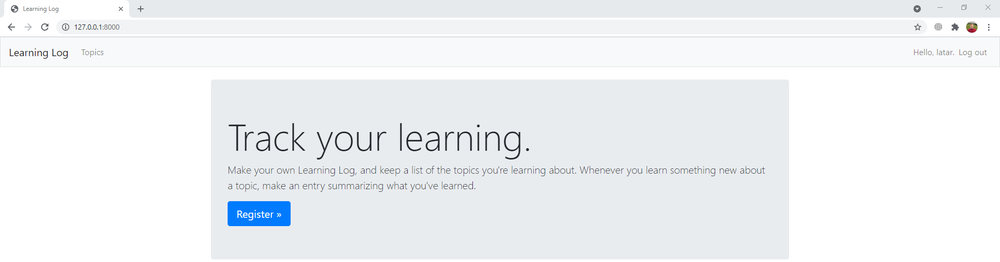

# Learning log
<div align=center margin= auto> 
  
</div>

# Learning log
Empty

# Introduction
Empty

# Requeriments
Empty

# Cloning the Repository

$ git clone https://github.com/Latarho/Learning_log.git

$ cd Learning_log

# Running 

```
$ python manage.py runserver
